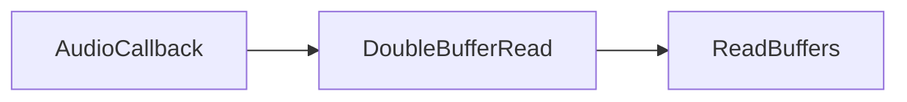

<html>

<head>
</head>
<body>

<h1>Plans <date>21/01/2026</date></h1>

<h3>Track Double Buffer</h3>

The double buffer base class needs to be abstracted into AudioDoubleBuffer.

This is for track level processing and will allow all tracks to 
implement a lock free way to to write to their buffer ahead of playback time.
In a seperate thread.

It will be a double buffer of type float, and will need some further
functionality.

For now this will just mean the ability to process an entire block
with added functionality, 
however in the future it will enable us to process lookaheads.

<h3>Audio Engine Write Thread</h3>

 A dedicated thread that allows me to implement the use of my 
double buffers. rather than hacking the mixMasterbuffer into the 
gui thread where it is currently.

This will further open the doors and allow me to accurately parse midi events
and generate audio buffers at a track level, with much less concern regarding read
and write indexes as it will implement checking functionality for the available samples.

Double buffers will also be magnitudes larger than the projects buffersize. 
This will allow complex computation that may have previously caused a 
stuttering effect.

<h3>Global Project Time</h3>

A single source of truth for the samplerate, bpm, tpq, beats per bar, 
counts per beat, etc. All tracks, clips, assets and effects can have a reference to this
so that when any of the values are changed there is no need to call update on every device.

None of the values should be automatable. and the change of any value would require a stop of audio. 

If we want to implement bpm or time signature automations at a later point. 

We will need to implement a tempo map, and a time signature map. 
The tempo map can include int64_t end tick and start tick.
as well as double start bpm end bpm. This allows the ability for
automation of the bpm without editing our single source of truth,
which would interfere with our processing logic. (samples to ticks to seconds etc).

If we want a time signature map the same would apply however time signature is not a continuos value.
so we can just store a single snapshot including the int beats per bar and bars per beat.

</body>
</html>
